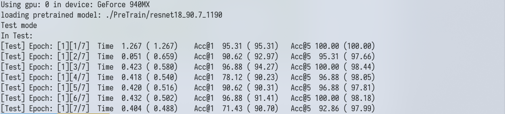
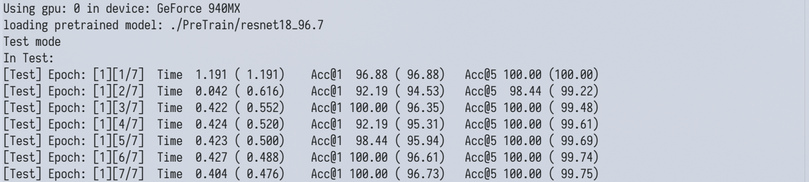
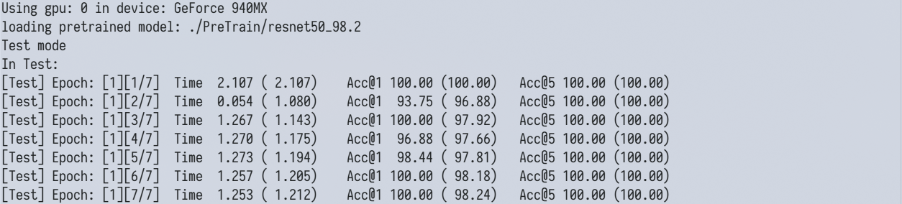
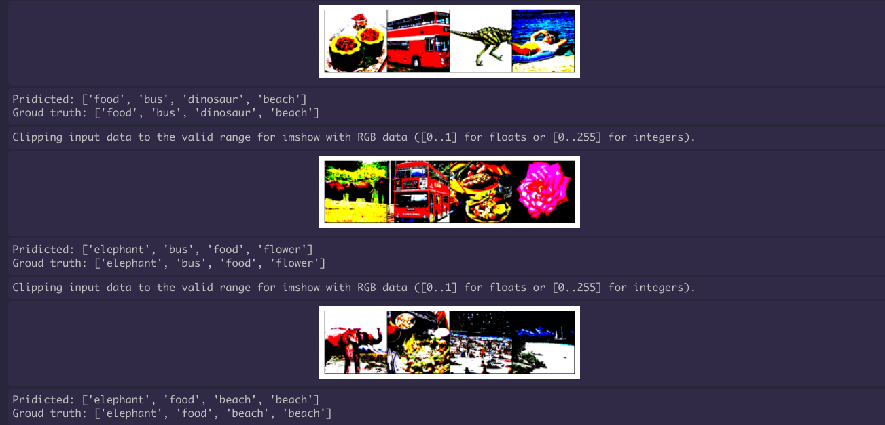
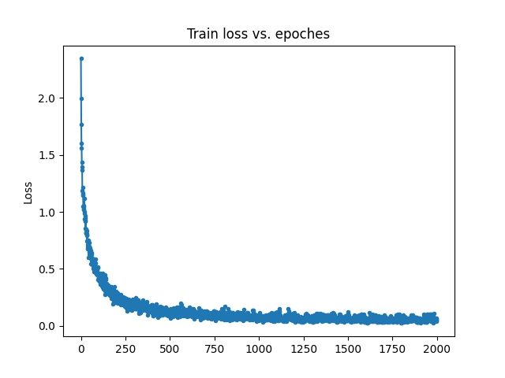

<!-- PROJECT -->
<br />

  <h3 align="center">ResOnCor</h3>

  <p align="center">
    Resnet implement on Corel-10 dataset
    <br />
    <a href="https://github.com/Peviroy/ResOnCor"><strong>Explore the docs »</strong></a>
    <br />


</p>

## Table of Contents

* [About the Project](#about-the-project)
  * [Directory tree](#Directory tree)
  * [Built With](#Built With)
  * [Requirement](#Requirement)
* [Getting Started](#getting-started)
  * [Prerequisites](#prerequisites)
  * [Installation](#installation)
* [Training](#Training)
* [TODO:](#TODO:)
* [Contact](#contact)
* [Acknowledgements](#acknowledgements)

## About The Project

As mentioned in the title, this project aims to solve Image classification problem on Corel-1000 dataset(you can get this in the dataset folder).

Using ResNet18, we got an accuracy of 90.6%. while by fine-tuning official pre-trained model, we got  accuracy of 97.7% in ResNet18 and 98.2% in ResNet50;

| model         | learning rate | batch size | accuracy |
| ------------- | ------------- | ---------- | -------- |
| ResNet18(pre) | 0.005         | 64         | 96.73%   |
| ResNet50(pre) | 0.005         | 64         | 98.24%   |
| ResNet18      | 0.01          | 64         | 90.7%    |

The architecture of the network is the core, but since there are so many open source codes, we are not just satisfied with reproducing network architecture. Instead, we expect to build a robust and maintainable system. Therefore this project was born.

### Directory tree

```bash
.
├── checkpoints					# saving the resulting models
├── data						# [python directory]Code to generate the data set
│   ├── __init__.py
│   └── dataset.py
├── dataset			
│   ├── test
│   │   ├── African
│   │   ├── ........
│   │   └── test.txt			# test namefile
│   └── train
│       ├── African
│       ├── .......
│       └── test.txt			# train namefile
├── models						# [python directory]model defination
│   ├── __init__.py
│   └── Resnet.py
├── utils						# [python directory]utility
│   ├── __init__.py
│   ├── util.py					
│   ├── torch_util.py
│   └── Meter.py				# Special dashboard for recording network output.
├── Result						# Result display
├── __init__.py
├── main.py						# entry file
├── grad_cam.py					
└── requirement.txt
```


### Built With

* [Pytorch](https://github.com/pytorch/pytorch)

### Requirement 

* matplotlib
* numpy
* torchvision
* opencv_python # This package has only been used in insignificant places and can be ignored.
* torch
* Pillow

#### versions  used

​	There is no feature code in this project, so any release version is ok. Here is my version below:

```
matplotlib==3.2.1
numpy==1.16.4
torchvision==0.5.0
opencv_python==4.2.0.34
torch==1.4.0
Pillow==7.1.1
```

### Some Result

#### Test mode

* resnet18_90.7

  

* resnet18_96.7

  

* resnet50_98.2

  

#### Validation mode



#### Trainning mode

* loss curve of resnet18_90.7 : loss--0.04



#### Hotmap

Using CAM, we can get the attention of the network;

While we did not unify the CAM method into the project.As fo how to use CAM method, you can view the github link inside the grad_cam file.


## Getting Started

### Prerequisites

Python virtual environment necessary to reproduce. Here [anaconda](https://www.anaconda.com/) is recommended. However, the virtual environment is not indispensable, any environment is welcome, as long as the environment can be built
* conda
```sh
conda create -n new_clean_env python=3.7
conda activate new_clean_env
```

### Installation

1. Clone the repo
```sh
git https://github.com/Peviroy/ResOnCor.git
```
2. Install requirements
```sh
cd ResOnCor
pip install -r requirements 
```

​		if internet speed is not ok, try switching mirror source or using [proxychains](https://github.com/haad/proxychains) for commandline proxy

## Training

#### Default 

To train a model, run `main.py` :

```
python main.py 
```

The default learning rate schedule starts at 0.01. This may be somewhat lower than usaual, but can converge steadily.

#### Using specific gpu

```
python main.py --gpu=k
```

#### Using pretrained model

```
python main.py --resume='</path/to/model>' #if use official pre-trained model, \
											call --official-pre insted
```

#### Validation mode | Test mode

Default mode is train mode, but validation mode and test mode are available

```
python main.py --validate=True
python main.py --test=True
```


#### Other parameter

We provide interface for determining hyper parameter such as batch size, learning rate, weight-decay, and so no.

For more augment infomation, call `--help`:

```bash
$python main.py --help
usage: main.py [-h] [--model-folder MODEL_FOLDER] [--resume RESUME]
               [--official-pre OFFICIAL] [--class-num CLASS_NUM]
               [--pre-epoch PRE_EPOCH] [--data DATA] [--batch BATCH]
               [--epoch EPOCH] [--save SAVE] [--lr LR]
               [--lr-decay-step LR_DECAY_STEP] [--momentum MOMENTUM]
               [--weight-decay WEIGHT_DECAY] [--gpu GPU] [--validate VALIDATE]
               [--test TEST] [--model MODEL]

Resnet on CorelDataset

optional arguments:
  -h, --help            show this help message and exit
  --model-folder MODEL_FOLDER
                        folder to save models
  --resume RESUME       path to latest checkpoint
  --official-pre OFFICIAL
                        path to official pre-trained model
  --class-num CLASS_NUM
                        number of classes classified
  --pre-epoch PRE_EPOCH
                        previous epoch (default: none)
  --data DATA           where the data set is stored
  --batch BATCH         batch size of data input(default: 64)
  --epoch EPOCH         the number of cycles to train the model(default: 200)
  --save SAVE           dir for saving document file
  --lr LR               learning rate(default: 0.01)
  --lr-decay-step LR_DECAY_STEP
                        lr decayed by 10 every step
  --momentum MOMENTUM   momentum(default: 0.9)
  --weight-decay WEIGHT_DECAY
                        weight decay (default: 5e-4)
  --gpu GPU             GPU id to use(default: 0)
  --validate VALIDATE   validation mode
  --test TEST           test only mode
  --model MODEL         resnet18、resnet34、resnet50，etc
```

## TODO:

- [x] Add lr decay function;

- [x] Pre-train mode

- [x] Validation mode
- [ ] CNN visualization

## Contact

- [email](https://twitter.com/twitter_handle) - peviroy@outlook.com

Project Link: [https://github.com/Peviroy/ResOnCor](https://github.com/Peviroy/ResOnCor)

## Acknowledgements

* [Official implement of resnet ](https://pytorch.org/docs/stable/_modules/torchvision/models/resnet.html#resnet)
* [ImageNet training in PyTorch](https://github.com/pytorch/examples/blob/master/imagenet/main.py)


